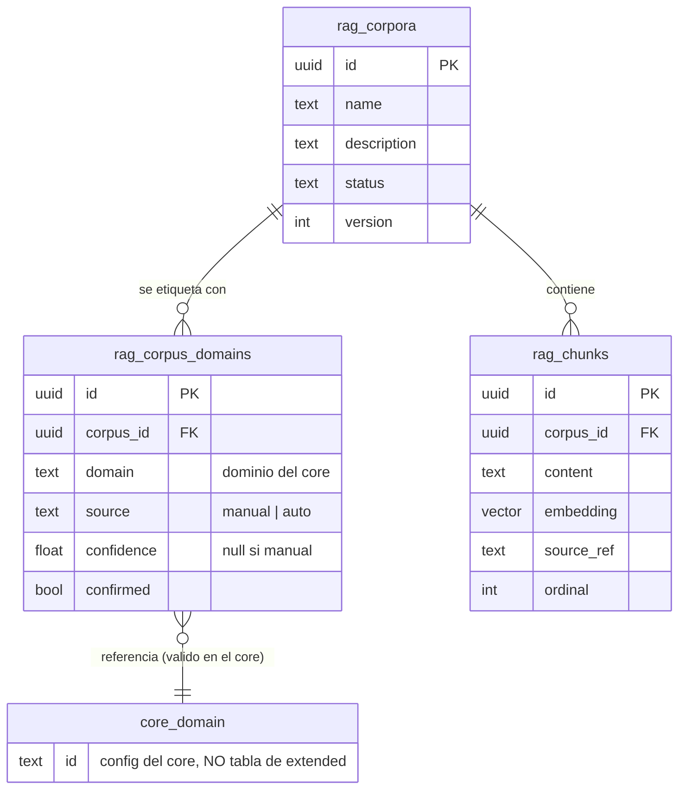
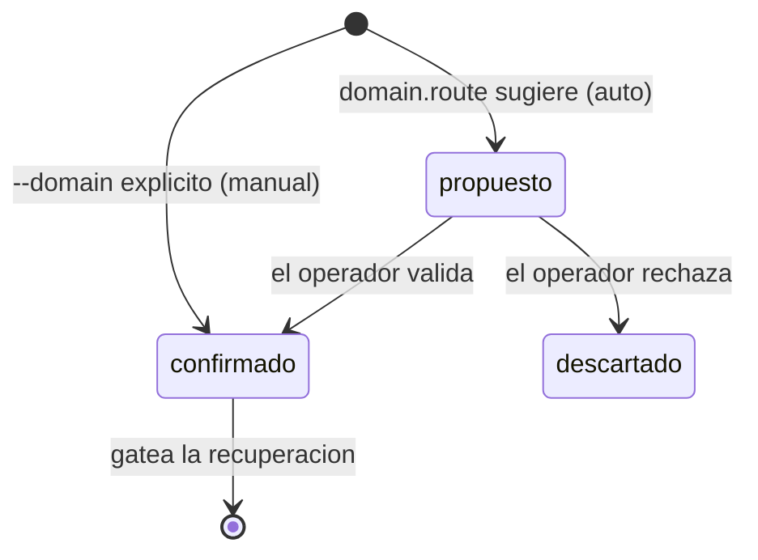
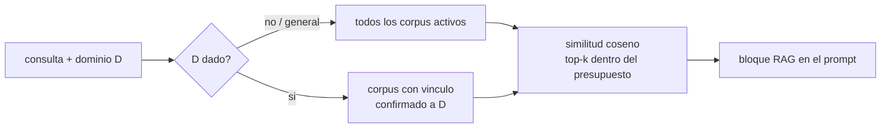

# Decision 0009: modelo de datos de conocimiento por dominio (N:M)

Fecha: 2026-08-12

Primera pieza de la fase "conocimiento por dominio" (extension de la Fase 5). El
workflow (ingesta auto-asistida, `knowledge maintain`, chequeo de completitud) se
reconcilia en una ronda posterior; esta ADR fija SOLO el modelo de datos.

## Premisa

El conocimiento es aprendizaje EXTERNO, no el yo del ente. Queda separado del eje
de simulacion de entidad (conscience, personalidad, memoria del yo). Su curacion
es del OPERADOR/ops, no de conscience. Conscience no toca el RAG de conocimiento
(su RAG etico es otra cosa, suya).

## Decision

Un mismo conocimiento sirve a varios dominios (Unix vale para `linux` y
`codigo`), y un dominio se nutre de varios corpus: la relacion es N:M. Se
sustituye el campo unico `rag_corpora.domain` por una tabla de union con
procedencia y confirmacion. El etiquetado es a nivel de CORPUS (unidad de
curacion); la granularidad por chunk se difiere hasta que un caso real la pida.

`core_domain` no es una tabla de esta capa: es el catalogo de dominios del core
(`domain.list`). El `domain` de la union debe ser uno valido; extended lo valida
al vincular, y un dominio retirado deja vinculos colgantes que caza el
`knowledge maintain` (ronda siguiente).

### Procedencia y confirmacion: la linea mecanico/juicio

`source` + `confirmed` codifican en los datos donde acaba lo mecanico y empieza
el juicio del operador. Un `--domain` explicito es `manual` y nace confirmado; un
dominio sugerido por `domain.route` es `auto` y nace SIN confirmar (una
propuesta). **La recuperacion solo gatea por vinculos confirmados.** Asi la
ingesta explicita es sin friccion y el auto-etiquetado es sugerencia hasta que se
valida.

Es el mismo motivo que ya usa el ente: como `unresolved_mentions` en memoria
(mecanico, pendiente de juicio) frente a `entity_refs` confirmados (ADR 0004).

### Recuperacion

El gate pasa de `corpus.domain = D` a "corpus con vinculo CONFIRMADO a D". Sin
dominio o `general` (agnostico), similitud global (D1, ADR 0008, intacto).

### Migracion

Cada `rag_corpora.domain` actual genera una fila `manual` / `confirmed` en
`rag_corpus_domains`; se elimina el campo `domain` de `rag_corpora`. Sin borrado
de chunks.

## Motivo

N:M porque el conocimiento no se reparte 1:1 con los dominios. Corpus-level porque
el corpus es la unidad de curacion y toda la vision (maintain, completitud,
recuperacion) funciona a ese nivel; la granularidad por chunk seria coste sin
necesidad demostrada. `source`/`confirmed` hace explicito, en el esquema, que el
auto-etiquetado es propuesta y la confirmacion es del operador.

## Consecuencia

- Migracion nueva con `rag_corpus_domains`; `rag_chunks` sin cambios; recuperacion
  gatea por vinculo confirmado.
- Pendiente de la ronda siguiente (workflow): ingesta auto-asistida con
  `domain.route`, `knowledge maintain` (re-etiquetado por ciclo de vida de
  dominios, vinculos colgantes), y chequeo de completitud (dominios sin
  conocimiento).
- Impacto de version: ninguno (sin contrato publico cortado; Fase 7).
