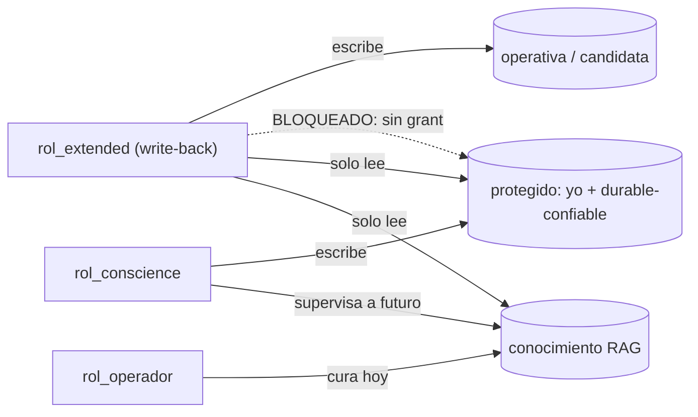

# Decision 0010: aislamiento de recursos y least-privilege (defensa en profundidad)

Fecha: 2026-08-13

## Motivo

La autoridad de escritura por principal (ADR 0002) es control de acceso LOGICO:
vive en el codigo, y un bug o un resquicio la puede saltar. Es una sola pared, y
depender de que el codigo sea perfecto es esperanza, no garantia. Se anade una
pared DURA, a nivel de recurso: least-privilege por rol/grant del motor y stores
separables. Asi, un fallo de codigo en extended NO puede escribir los almacenes
protegidos, porque postgres lo rechaza por debajo, sin confiar en nuestro codigo.

Modelo de amenaza: entidades externas maliciosas (otras IAs) que, interactuando
con el ente, intenten inyectar memoria o conocimiento no deseado y envenenar su
comportamiento durable (memory poisoning; que la instancia se vuelva
"terraplanista"). Conscience es el supervisor aislado; la pared dura garantiza
que ni un extended con bugs corrompa lo protegido.

## Decision

La autoridad de escritura se aplica en DOS niveles: (1) principal en codigo
(ADR 0002), (2) GRANT del motor. El segundo no confia en el codigo.

Stores segmentados por confianza, con roles de least-privilege:

| Store | Escribe | Lee |
|---|---|---|
| operativa / candidata (`dialog`, `episodic` candidato) | `rol_extended` (write-back) | extended, conscience |
| protegido: el yo + durable-confiable (`semantic` confiable, `persona`, `principles`, `identity`) | `rol_conscience` | extended (para enriquecer), conscience |
| conocimiento operativo (RAG) | `rol_operador` (hoy) / `rol_conscience` (futuro, supervisado) | extended (para enriquecer) |
| conocimiento etico (RAG de conscience) | `rol_conscience` | conscience |

Reglas:

- `rol_extended` (write-back de conversacion): escribe operativa/candidata;
  READ-ONLY sobre lo protegido y el conocimiento (necesita LEER para enriquecer);
  SIN grant de escritura sobre el yo, lo durable-confiable ni el conocimiento. Un
  bug en extended no puede envenenar lo protegido.
- `rol_conscience`: escribe el yo protegido y lo durable-confiable; gobierna (a
  futuro) la incorporacion de conocimiento.
- `rol_operador`: cura el conocimiento hoy (stand-in de la supervision futura de
  conscience).
- `core`: no lee nada directamente (via 2); read-only si algun dia lo hiciera.
- Los dos RAG (conocimiento operativo + etico) son stores separados; el etico es
  de conscience.

Separabilidad desde el dia uno: los stores protegidos con schema propio, sin
joins que aten operativo y protegido, para poder ESCALAR el aislamiento sin
reescribir:

    rol/grant  ->  schema separado  ->  base separada  ->  instancia/host separado (DMZ)

Hoy (dev, una base, un usuario) se documenta y se mantiene la separabilidad; la
implementacion de roles/grants es un endurecimiento progresivo, no un requisito
de arranque.

## Consecuencia

- Refuerza el cortafuegos candidato->confiable (enmienda ADR 0007): el candidato
  vive en la operativa (extended escribe); lo confiable, en el store protegido
  (solo conscience escribe). La pared logica (tag `confirmed`) y la dura (grant)
  actuan juntas: defensa en profundidad.
- Refina ADR 0002 (autoridad en dos niveles) y ADR 0009 (la incorporacion de
  conocimiento esta supervisada -operador hoy, conscience futuro- y su store es
  aislado; el conocimiento sigue siendo externo, no el yo del ente).
- La escalada de aislamiento no exige reescritura: es un cambio de topologia de
  recursos. En parte es decision de despliegue.
- Impacto de version: ninguno (arquitectura de seguridad/despliegue; sin contrato
  publico cortado).
